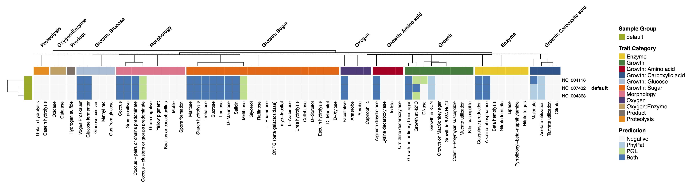

# Traitar2 &ndash; The Microbial Trait Analyzer

[](http://www.gnu.org/licenses/gpl-3.0)
[](https://www.python.org/downloads/release/python-3100/)

**Traitar2** is a software tool for predicting microbial phenotypes from nucleotide or amino acid sequences. It accurately predicts [67 diverse traits](TRAITS.md), including carbon source utilization, oxygen requirements, morphology, and antibiotic susceptibility.

This version is an enhanced fork of the original [Traitar](https://github.com/hzi-bifo/traitar), modernized for **Python 3.10+** with significant improvements in performance, automation, and reporting.

---

## ⚡ Key Improvements in Traitar2

* **Modern Compatibility**: Full support for Python 3.10+, Pandas 2+, and modern Unix environments.
* **Intuitive Defaults**: Automatically assumes `from_nucleotides` mode and scans your directory for genomes.
* **Faster Execution**: Parallel processing enabled by default (`-t 4`) using GNU Parallel.
* **Automated Reporting**:
  * **Phenotypic Table**: Generates a publication-ready `Phenotypic_table.md` in IJSEM style.
  * **Interactive Heatmaps**: Automatic generation of clustered heatmaps (PDF/PNG).
* **Robust Data Setup**: Intelligent Pfam database handler that manages compression (`.gz`) and HMMER indexing (`hmmpress`) automatically.

---

## 🚀 Quick Start (For the Impatient)

If you have a folder full of genomes (`.fasta`, `.fna`, `.fa`, or `.gz`), just run:

```bash
traitar2 phenotype -d genomes_dir
```

Traitar2 will automatically:

1. **Predict genes** using Prodigal.
2. **Annotate Pfam families** using HMMER.
3. **Predict 67 phenotypes** using machine learning models.
4. **Generate results** in `traitar_results/`, including a professional summary table and heatmaps.

---

## 🛠 Installation

The easiest way to install Traitar2 is using [Mamba](https://mamba.readthedocs.io/en/latest/installation.html) or Conda:

### 1. Clone the repository

```bash
git clone https://github.com/GenomicaMicrob/Traitar2
cd traitar2
```

### 2. Create the environment

```bash
mamba env create -f environment.yml
conda activate traitar2
```

### 3. Install the package

```bash
pip install .
```

### 4. Download external Pfam HMMs database

Traitar2 requires the Pfam database v27 to function. Run the following command to download and set it up automatically. You need to run this command only once.

```bash
traitar2 pfam pfam_db
```

This will download approximately 230 MB of data and configure the project root for its access to the database.

[!TIP]
If you already have the Pfam database (`Pfam-A.hmm`) on your system, you can skip the download by pointing Traitar to its directory:

```bash
traitar2 pfam --local /path/to/your/pfam_folder/
```

The Pfam database can be manually downloaded from: [ftp://ftp.ebi.ac.uk/pub/databases/Pfam/releases/Pfam27.0/Pfam-A.hmm.gz](ftp://ftp.ebi.ac.uk/pub/databases/Pfam/releases/Pfam27.0/Pfam-A.hmm.gz)

If you want to install the database in one location and then move the Pfam folder to a new one, you have to run the above command (`--local`) again in order for traitar2 to fix the path to the database.

> [!NOTE]
> For alternative installation methods (e.g., manual installation, Python venv) or detailed troubleshooting, please refer to the [INSTALL.md](INSTALL.md) guide.

---

## 📖 Basic Usage

First activate your conda environment:

```bash
conda activate traitar2
```

### Phenotyping from Nucleotide Sequences (Default)

By default, Traitar2 scans your input directory for fasta files. You can provide an **optional** mapping file (`-i genome_list.tsv`) to control sample names and categories (clades), which will be reflected in the heatmaps.

The **genome_list.tsv** should be **tab-separated** with a mandatory header row:

```text
sample_file_name  sample_name   category
genome1.fna       Strain_A      Group_1
genome2.fna.gz    Strain_B      Group_1
```

Acceptable characters for the `sample_name` and `category` columns are:

* Alphanumeric characters (`a-z`, `A-Z`, `0-9`)
* Underscores (`_`)
* Hyphens (`-`)

Run the analysis:

```bash
traitar2 phenotype -d genomes_dir -i genome_list.tsv -o results -t 8
```

You can also choose the heatmap layout (horizontal by default):

```bash
traitar2 phenotype -d genomes_dir -o traitar2_results --heatmap_orientation vertical
```

Or once you ran the script and want to change the layout of the heatmap, run:

```bash
traitar2 plot -d traitar2_results --heatmap_orientation vertical
```

`horizontal` keeps samples as rows and phenotypes as columns, `vertical` swaps that layout.
For `plot`, point `-d` to the root of a previous run, for example `traitar2_results/`. The command will reuse the prediction files under `traitar2_results/phenotype_prediction/` and place the new heatmap output under the same run by default. **Caution!** it will overwrite the previous heatmap.

#### Positional Arguments

For consistency with the traditional Traitar interface, you can also use positional arguments (in this strict order):

```bash
traitar2 phenotype genomes_dir genome_list.tsv from_nucleotides results_dir
```

Or simply:

```bash
traitar2 phenotype genomes_dir
```

This will trigger the standard workflow of Traitar2, which is to predict open reading frames with Prodigal, annotate the coding sequences provided as nucleotide FASTAs in the `genomes_dir` for all samples in `genome_list.tsv` with Pfam families using HMMer, and finally predict phenotypes from the models for the 67 traits. Results will be in `traitar2_results/`.

### Phenotyping from gene sequences

If you already have gene predictions (e.g., from Prodigal as `.faa` files), skip the gene prediction step:

```bash
traitar2 phenotype -m from_genes -d genes_dir -i genome_list.tsv
```

### Inspect Classification Models

Traitar2 can show you the protein families (Pfam) that are most important for each original phenotype model:

```bash
traitar2 show 'Glucose fermenter'
```

will show the majority features i.e. the Pfam families that contribute to the assignment of the trait Glucose fermenter with *phypat* classifier to some genome sequence. Via `--predictor` the user may specify the classifier (phypat, phypat+PGL).

---

## 🧪 Example Case: *Streptococcus agalactiae*

Three genomes of *Streptococcus agalactiae* are provided in the `example/` directory. You can run traitar2 as follows:

```bash
traitar2 phenotype -d example/ -o agalactiae_results
```

### Example Outputs

#### 1. Visual Summary (Heatmap)

A high-quality visual overview of all predicted traits:


#### 2. IJSEM-Style Phenotypic Table

A publication-ready summary (`Phenotypic_table.md`) highlighting differences between samples:

---

### Predicted phenotypes of samples

| Characteristic | NC_004116 | NC_004368 | NC_007432 |
| :--- | :---: | :---: | :---: |
| DNase | + | - | - |

---

**Positive results were found for:** Acetate utilization, Alkaline phosphatase, Arginine dihydrolase, Coagulase production, Coccus, Coccus - clusters or groups predominate, Coccus - pairs or chains predominate, D-Mannose, Facultative, Glucose fermenter, Gram positive, Growth at 42°C, Growth in KCN, Growth on ordinary blood agar, Lactose, Malonate, Maltose, Melibiose, Salicin, Starch hydrolysis, Sucrose, Trehalose, Voges Proskauer.

**Negative results were found for:** Aerobe, Anaerobe, Bacillus or coccobacillus, Beta hemolysis, Bile-susceptible, Capnophilic, Casein hydrolysis, Catalase, Cellobiose, Citrate, Colistin-Polymyxin susceptible, D-Mannitol, D-Sorbitol, D-Xylose, Esculin hydrolysis, Gas from glucose, Gelatin hydrolysis, Glucose oxidizer, Glycerol, Gram negative, Growth in 6.5% NaCl, Growth on MacConkey agar, Hydrogen sulfide, Indole, L-Arabinose, L-Rhamnose, Lipase, Lysine decarboxylase, Methyl red, Motile, Mucate utilization, Nitrate to nitrite, Nitrite to gas, ONPG (beta galactosidase), Ornithine decarboxylase, Oxidase, Pyrrolidonyl-beta-naphthylamide, Raffinose, Spore formation, Tartrate utilization, Urea hydrolysis, Yellow pigment, myo-Inositol.

---

### Phenotype prediction - Tables and flat files

These heatmaps are based on tab separated text files e.g. `predictions_majority-vote_combined.txt`. A negative prediction is encoded as 0, a prediction made only by the pure phyletic classifier as 1, one made by the phylogeny-aware classifier by 2 and a prediction supported by both algorithms as 3. `predictions_flat_majority-votes_combined.txt` provides a flat version of this table with one prediction per row. The expert user might also want to access the individual results for each algorithm in the respective sub folders `phypat` and `phypat+PGL`.

### Phenotype-relevant protein families and feature tracks

Traitar2 will link the protein families and predicted phenotypes. The results can be found in `phypat/feat_gffs` and `phypat+PGL/feat_gffs`. If the user picked the 'from nucleotides' option, Traitar2 will also generate GFF files that link the genes called by Prodigal with the important protein families. The phenotype-specific protein family annotations tracks can be visualized via GFF files in a genome browser of choice.

#### Feature tracks with *from_genes* option (experimental feature)

If the *from_genes* option is set, the user may specify gene GFF files via an additional column called gene_gff in the sample file. As gene ids are not consistent across gene GFFs from different sources e.g. img, RefSeq or Prodigal the user needs to specify the origin of the gene gff file via the `-g` / `--gene_gff_type` parameter. Still there is no guarantee that this works currently. Using *samples_gene_gff.txt* as the sample file in the above example will generate phenotype-specific Pfam tracks for the two genomes.

`traitar2 phenotype . samples_gene_gff.txt from_genes traitar_out -g refseq`

### Traitar2 models

Traitar2 uses two related support vector machine (SVM) models that differ in whether they explicitly model protein-family evolution on the species tree.

**phypat model**: This classifier uses only the presence/absence (phyletic patterns) of Pfam protein families in each genome to predict phenotypes, training an L1-regularized L2-loss SVM directly on these binary Pfam profiles and observed trait labels.

**phypat+PGL model**: This classifier uses the same Pfam presence/absence data but augments it with inferred ancestral gains and losses (PGL) of protein families and phenotypes along the species phylogeny, incorporating these evolutionary events into the SVM training to better capture horizontally transferred trait-related genes and improve prediction accuracy.

---
## Citing Traitar

If you use Traitar2 in your research, please cite the following publication:

Weimann A, Mooren K, Frank J, Pope PB, Bremges A, McHardy AC. **From Genomes to Phenotypes: Traitar, the Microbial Trait Analyzer.** *mSystems*. 2016 Dec 27;1(6):e00101-16. [doi: 10.1128/mSystems.00101-16](https://doi.org/10.1128/mSystems.00101-16).
PMID: 28066816; PMCID: [PMC5192078](https://pubmed.ncbi.nlm.nih.gov/28066816/).
